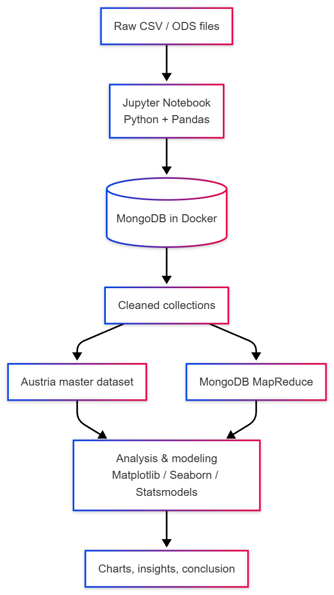

# Austria’s Baby Deficit: How Housing Costs and Economic Pressure Are Keeping Birth Rates Low 
### An analysis of Austria's demographic and macroeconomic development over the last two decades

---
Course: “Big Data Infrastructure”

Team: Elias Grünbacher, Peter Kovacs, Mario Lagger

---

## Project overview

The project uses a Jupyter notebook + MongoDB + Docker workflow to ingest raw public datasets, clean and harmonize them, store them in MongoDB, and analyze the relationship between economic pressure and fertility trends across Austria.


Austria, like many developed economies, has seen a sustained decline in fertility and birth rates. This project investigates whether this decline is associated with:

- **Housing costs**
- **Macroeconomic performance**
- **Employment dynamics**
- **Unemployment and economic uncertainty**

Using official datasets from Statistik Austria, the notebook combines demographic and macroeconomic indicators and evaluates them through:

- data ingestion into MongoDB
- cleaning and harmonization with pandas
- regional and national exploratory analysis
- correlation analysis
- a MapReduce calculation
- a multivariate forward-selection regression model


## Main research question

**To what extent are falling fertility rates in Austria associated with rising housing costs and broader economic pressure?**


## Key findings

The notebook’s analysis points to several clear results:

* **Clear regional gap:** Western Austria has the highest average fertility, while eastern and southern regions are lower. The west–east divide is consistent across the data.
* **Regional wealth matters only a little:** At regional level, richer areas show only a **weak positive relationship** with fertility. Economic output alone is not enough to explain differences.
* **National trend goes the other way:** Over time, as Austria’s overall economy grew, fertility still declined. This suggests that long-term modernization and rising living costs offset the benefits of growth.
* **Housing is a major factor:** Rising housing prices show a **moderate negative correlation** with fertility. This supports the idea that affordability pressures discourage family formation.
* **Overall employment is not useful as a predictor:** Total employment has almost no linear relationship with fertility.
* **Female employment is more nuanced:** Across the full period the relationship is weak, but from **2007–2021** it becomes **strongly positive**, suggesting fertility can coexist with higher female employment when childcare, flexibility, and policy support are stronger.
* **Unemployment shows a positive correlation, but this is misleading on its own:** The notebook interprets this as a mix of time-lag effects, shock years, and changing opportunity costs rather than a simple causal effect.
* **Best multivariate result:** The strongest combined model uses unemployment rate + GRP, with a multiple correlation of 0.727 and adjusted R² of 0.443. In other words, these two variables together explain about 44% of fertility variation in the model.


## Tech stack

- Python
- Jupyter Notebook
- MongoDB
- Docker / Docker Compose
- pandas
- NumPy
- matplotlib
- seaborn
- statsmodels
- PyMongo

The notebook was tested in this environment:

- Python 3.14.2
    - Python package versions are listed in "requirements.txt"
- MongoDB 8.2.7
- Docker Desktop 4.69.0


## Repository Structure

- `austrias-baby-deficit.ipynb` — main notebook
- `docker-compose.yml` — MongoDB in docker container
- `requirements.txt` — Python dependencies used for the notebook
- `raw_data/` — input files used by the notebook (CSV/ODS)
- `pictures/` — images used in the notebook
- `architecture-diagram.mermaid` — architecture diagram


## Architecture




## Data Sources

All sources are official datasets from Statistik Austria:

1) Crude birth rate (Rohe Geburtenrate)
- https://data.statistik.gv.at/web/meta.jsp?dataset=OGD_indquot001_HVD_INDQUOTE_6

2) Total fertility rate (Gesamtfertilitätsrate)
- https://data.statistik.gv.at/web/meta.jsp?dataset=OGD_indquot001_HVD_INDQUOTE_3

3) Housing Price Index (Häuserpreisindex)
- https://www.statistik.at/statistiken/volkswirtschaft-und-oeffentliche-finanzen/preise-und-preisindizes/haeuserpreisindex-und-ooh-pi

4) Gross Regional Product (Bruttoregionalprodukt)
- https://www.statistik.at/en/statistics/national-economy-and-public-finance/national-accounts/regional-accounts

5) Employment rates (Erwerbstätigkeitsquote)
- https://www.statistik.at/statistiken/bevoelkerung-und-soziales/gender-statistiken/erwerbstaetigkeit

6) Unemployment rates (Arbeitslosenquote)
- https://www.statistik.at/statistiken/bevoelkerung-und-soziales/gender-statistiken/erwerbstaetigkeit

The downloaded files used by the notebook are in `raw_data/`.


## Workflow

The notebook follows this pipeline:

1. Start MongoDB via Docker
2. Ingest raw CSV and ODS files into MongoDB
3. Inspect raw collections
4. Clean and standardize each dataset
5. Store cleaned datasets in new MongoDB collections
6. Build a national master dataset
7. Run regional and national analyses
8. Visualize relationships
9. Run a forward-selection multivariate regression


## Quickstart

### Prerequisites

- Python (notebook was developed with Python 3.x; dependencies are pinned in `requirements.txt`)
- Docker Desktop (for MongoDB)
- VS Code with Jupyter extension (or JupyterLab)

### 1) Start MongoDB (Docker)

From the repository root:

```bash
docker compose -f docker-compose.yml -p bdinf_project up -d
```

MongoDB will be available at:
- `mongodb://localhost:27017`

To stop it:

```bash
docker compose -f docker-compose.yml -p bdinf_project down
```

### 2) Install dependencies

```bash
pip install -r requirements.txt
```

### 3) Run the notebook

Open `00_FINAL_BigDataInfNotebook.ipynb` and run cells top-to-bottom.

Notes:
- The notebook starts MongoDB via Docker from inside a cell (using `!docker compose ...`). If your Jupyter environment cannot execute shell commands, start MongoDB via the terminal (step 1) and continue.
- Ingestion cells drop and re-create MongoDB collections to keep re-runs deterministic.


## MongoDB: Database & Collections

The notebook stores both raw and cleaned data in a local MongoDB database:

- **MongoDB URI:** `mongodb://localhost:27017/`
- **Database name:** `mongo_db`

### Raw collections
- `raw_birthrate`
- `raw_fertility_rate`
- `raw_GRP`
- `raw_GRP_per_capita`
- `raw_HPI`
- `raw_emp_zusammen`
- `raw_emp_maenner`
- `raw_emp_frauen`
- `raw_unemp_zusammen`
- `raw_unemp_maenner`
- `raw_unemp_frauen`

### Cleaned collections
- `clean_birthrate`
- `clean_fertility_rate`
- `clean_GRP`
- `clean_GRP_per_capita`
- `clean_HPI`
- `clean_unemployment_rate`
- `clean_employment_rate`
- `austria_master_summary`


## Troubleshooting

- **Port 27017 already in use**: stop the other MongoDB service, or change the port mapping in `docker-compose.yml`.
- **`odf` / ODS read errors**: the notebook uses `pandas.read_excel(..., engine='odf')`; ensure `odfpy` is installed (it is included in `requirements.txt`).
- **Docker not found inside notebook**: run Docker Compose from the terminal instead of the notebook cell.

## Acknowledgments

- **Statistik Austria** for the source datasets
- Public demographic and macroeconomic research on fertility, labor markets, and housing affordability in Austria

## License

```text
MIT License
```